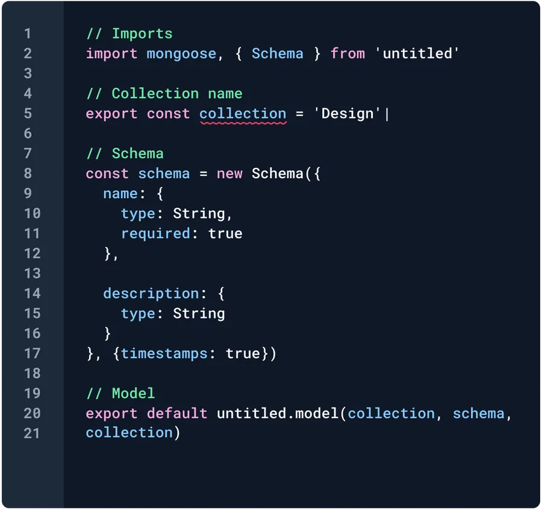

用一句话概括 eslint 和 prettier 的区别:

> Prettier for formatting and linters for catching bugs!
>
> ---- come from [prettier.io](https://prettier.io/docs/en/comparison)

此处放置 [Eslint](https://eslint.org/) 和 [Prettier](https://prettier.io/) 的官网地址。



## 1. Prettier 的使用

Prettier 的本质作用就是格式化代码，没有其他的副作用。
Prettier 有两种使用方式，你既可以在一个**标准的 Nodejs 项目**中使用它，也可以在**不含 Nodejs 的项目中**使用它。

### 在 Nodejs 项目中

在 Nodejs 项目中，首先将 Prettier 添加为开发依赖。

```bash
npm install --save-dev --save-exact prettier
```

然后再项目根目录下添加`.prettierrc.js`文件。

```js
module.exports = {
  // 一行最多 120 字符
  printWidth: 120,
  // 使用 2 个空格缩进
  tabWidth: 2,
  // 不使用制表符，而使用空格
  useTabs: false,
  // 行尾需要有分号
  semi: true,
  // 使用单引号
  singleQuote: true,
  // 对象的 key 仅在必要时用引号
  quoteProps: 'as-needed',
  // jsx 不使用单引号，而使用双引号
  jsxSingleQuote: false,
  // 末尾不需要逗号
  trailingComma: 'all',
  // 大括号内的首尾需要空格
  bracketSpacing: true,
  // jsx 标签的反尖括号需要换行
  jsxBracketSameLine: false,
  // 箭头函数，只有一个参数的时候，也需要括号
  arrowParens: 'always',
  // 每个文件格式化的范围是文件的全部内容
  rangeStart: 0,
  rangeEnd: Infinity,
  // 不需要写文件开头的 @prettier
  requirePragma: false,
  // 不需要自动在文件开头插入 @prettier
  insertPragma: false,
  // 使用默认的折行标准
  proseWrap: 'preserve',
  // 根据显示样式决定 html 要不要折行
  htmlWhitespaceSensitivity: 'css',
  // 换行符使用 lf
  endOfLine: 'auto',
};
```

有需要的话，还可以添加`.prettierignore`文件，与`.gitignore`类似的写法。然后就可以运行格式化命令了。

```bash
npx prettier ./src --write
```

### 在非 Nodejs 项目中

在非 Nodejs 项目中，由于缺少 nodejs 环境，无法通过命令格式化文件。此时的格式化是依赖于编辑器的。例如在 vscode 中，需要安装扩展插件`esbenp.prettier-vscode`。并在`./.vscode/settings.json`中加入如下配置，使得 prettier 插件能生效。

```json
{
  // 使用prettier插件作为默认格式化器
  "editor.defaultFormatter": "esbenp.prettier-vscode",
  // 关闭时自动保存
  "editor.formatOnSave": true,
  // 保存时格式化整个文件，而不仅仅是修改的部分
  "editor.formatOnSaveMode": "file",
  // 关闭json插件自带的格式化，如果本地有其他语言的格式化器，请也关闭，避免冲突
  "json.format.enable": false,
  // 修改指定的语言的配置（以上都是默认配置，
  // 某些语言可能本地有单独的配置，优先级更高，
  // 此处是为了覆盖那些优先级更高的配置）
  "[javascript,typescript,markdown,json]": {
    "editor.defaultFormatter": "esbenp.prettier-vscode"
  }
}
```

然后书写 prettier 配置文件`./prettierrc.js`。vscode 会根据该文件进行代码的格式化。

```js
module.exports = {
  // 一行最多 120 字符
  printWidth: 120,
  // 使用 2 个空格缩进
  tabWidth: 2,
  // 不使用制表符，而使用空格
  useTabs: false,
  // 行尾需要有分号
  semi: true,
  // 使用单引号
  singleQuote: true,
  // 对象的 key 仅在必要时用引号
  quoteProps: 'as-needed',
  // jsx 不使用单引号，而使用双引号
  jsxSingleQuote: false,
  // 末尾不需要逗号
  trailingComma: 'all',
  // 大括号内的首尾需要空格
  bracketSpacing: true,
  // jsx 标签的反尖括号需要换行
  jsxBracketSameLine: false,
  // 箭头函数，只有一个参数的时候，也需要括号
  arrowParens: 'always',
  // 每个文件格式化的范围是文件的全部内容
  rangeStart: 0,
  rangeEnd: Infinity,
  // 不需要写文件开头的 @prettier
  requirePragma: false,
  // 不需要自动在文件开头插入 @prettier
  insertPragma: false,
  // 使用默认的折行标准
  proseWrap: 'preserve',
  // 根据显示样式决定 html 要不要折行
  htmlWhitespaceSensitivity: 'css',
  // 换行符使用 lf
  endOfLine: 'auto',
};
```

其实在 vscode 中，Prettier 的作用不仅仅局限于前端相关的技术。对于每种文件都有一个插件，例如对于 Java 的插件是`dotdevru.prettier-java`，对于 SQL 的插件是`inferrinizzard.prettier-sql-vscode`。

::: tip
推荐同时安装 Nodejs Prettier 依赖和 vscode 插件，前者能确保开发时及时纠正格式，后者用于在拉取请求时提供代码格式校验。
:::

## 2. Eslint 的使用

TODO
